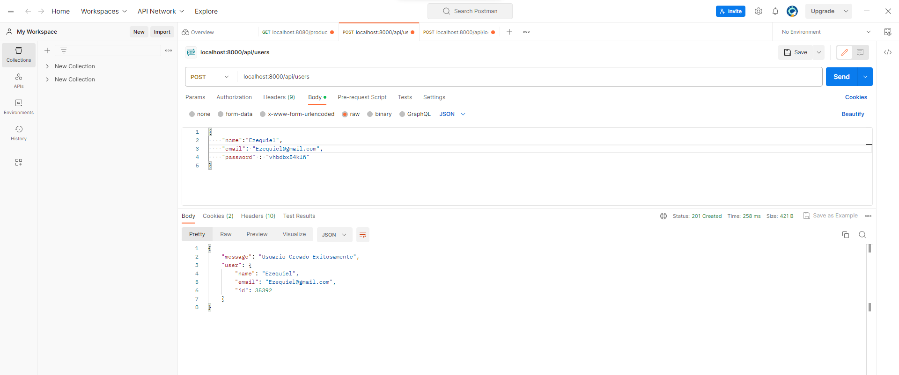

 Sistema de Gestión Sistema de Gestión Integrado

Descripción:
Este repositorio contiene el código fuente del Sistema de Gestión Integrado, una aplicación diseñada para brindar una solución integral de gestión de clientes y productos. El sistema permite a los usuarios realizar compras, ventas y llevar un registro detallado de todas las transacciones comerciales.

Características destacadas:

Autenticación segura basada en JSON Web Tokens (JWT) para garantizar que solo los usuarios autorizados, incluidos los administradores, puedan acceder a funciones críticas.
APIs RESTful que facilitan la gestión de clientes, productos y compras, permitiendo la interacción con el sistema de manera sencilla y eficiente.
Lógica de negocio implementada para relacionar compras con clientes y productos, calculando automáticamente el total de la compra y la cantidad de productos involucrados.

Aqui nos registramos y y como vemos aun no somo admintradores por tanto no podemos acceder a las rutas protegitas

Vemos el usurio registrado en la Base de datos

Ahora para darle acceso administrador al el usurio creado editamos la columna admin en la base de atos y le asigansmo un TRUE (1)

Ahora con las credeciales en la ruta localhost:8000/api/login, nos logueamos y como vemos ya una vez logueado nos da la informacion del token parar la aurizacion y poder acceder a las rutas protegidas

Aqui se puede observar la informacion del token, el caul lo usaremos para acceder al sistema y poder hacer el registro de producto, clintes y de las compras, ademas se puede observar que tenemos permisos de administrador

si quiero observar todas la compras realizadas tengo que poner el mi token en la parte de autorizacion y el token es de tipo bearer Token, y aluego accemos una petidion get a la ruta localhost:8000/api/compras la cual nos devuelve todas las compras realizadas

si intENTO acceder a una ruta que es protegita si el token de autorizacion,me va mostrar un mensaje indicandome de que nos estoy autizado

ahora si yo le quito los derechos o permisos de adminitrado a el usuario, aun coloque el token de autorizacion, no voy a poder ver la informacion de las compras o mas bien no vpy a poder entrar a las rutas que requieren que seas administrador y que ademas este logueado o autorizado

como se puede observar en esta aqui, intentamos acceder a una ruta parar traaer todas las compras realizadas, aunque hayamos puesto el token de autorizzacion o de auntenticacion, como desahbilite los permisos de adminitrador a dicho usurio no va poder acceder a la ruta parar poder ver las compras realizadas

lo mismo tambien pasa con las demas rutas como por ejemplo aqui borramos una compra

y si vemos si intenamos buscar dicha compra por su id, observamos de que ela compra dse borro exitosamente

y como vemos tambien podemos acceder a las demas rutas como por ejemplo aui traemos todos los productos que se encuentra registrados

aqui como se puede observar traemos a todos los clientes registrados

## About Laravel

